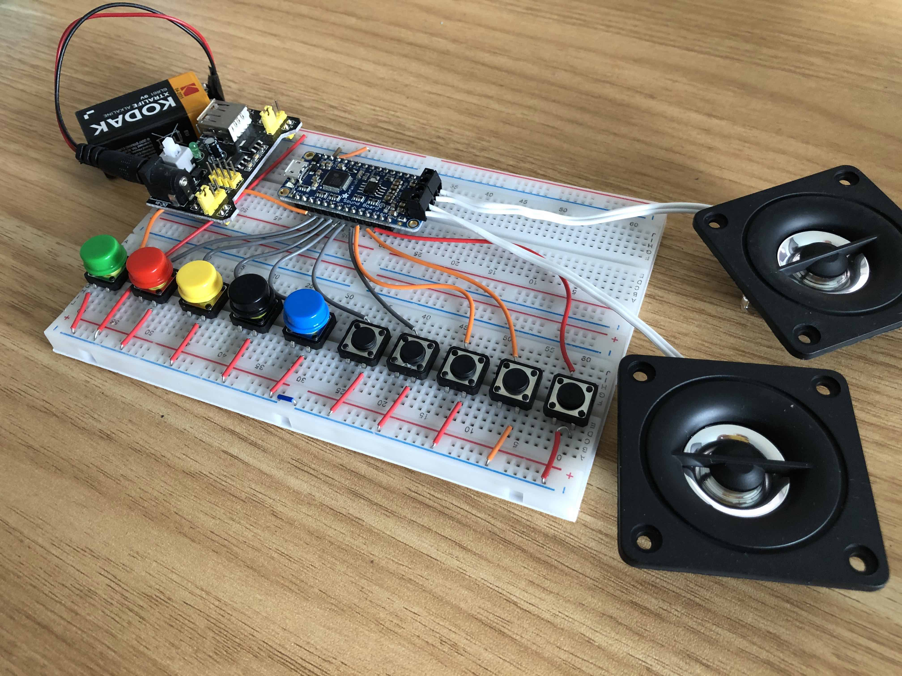

# Talkboard

A simple and low-cost button-to-speech assistive device for people with speech assistance needs.

*Note: Talkboard is currently in prototype stage.*

### Features:

* Portable - runs on a single 9V battery.
* Ergonomic. People with speech difficulties often have movement issues as well. The device is designed to be as inclusive as possible.
* Simple - Zero setup needed. Turn on, press button, sound comes out.
* Usable by default. Built-in sounds for common needs. e.g. "Yes", "No", "Thank you", "Hello", "Goodbye", "Thirsty", "Help", etc.
* Customisable - plugs in to any computer via USB for sound customisation.
* 10 button-triggered sounds can be programmed.
* Instant-on.
* Rugged and robust. Will survive drops and knocks.

### Building one Yourself

1. Obtain the [controller module](https://www.adafruit.com/product/2210).
2. Construct the circuit (schematic coming soon).
3. 3d print the case (in progress).
4. (optional) Customise the sound presets.